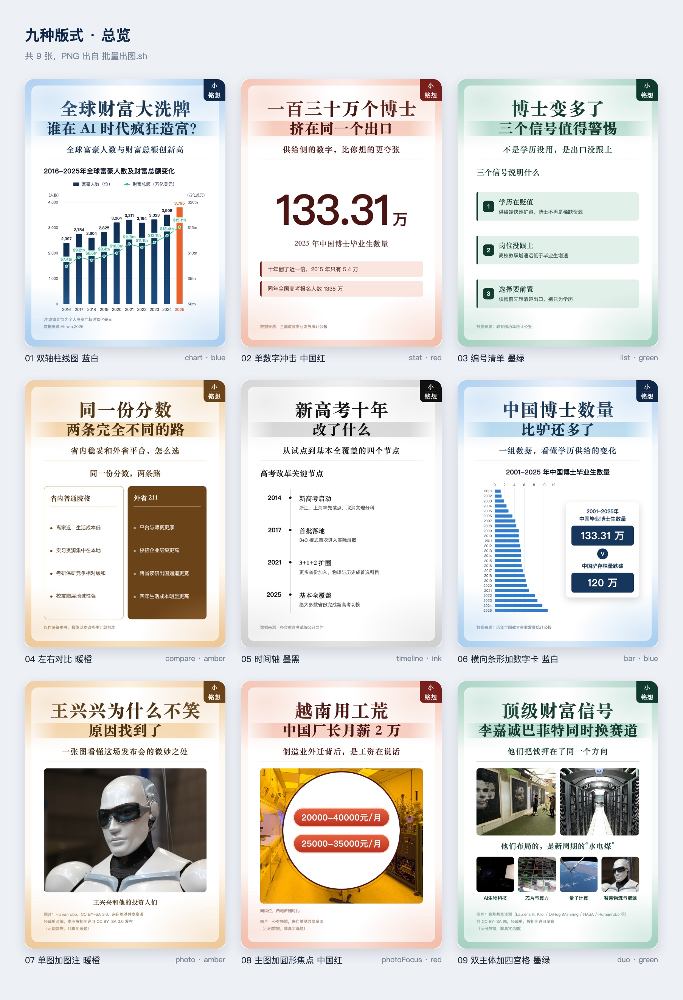
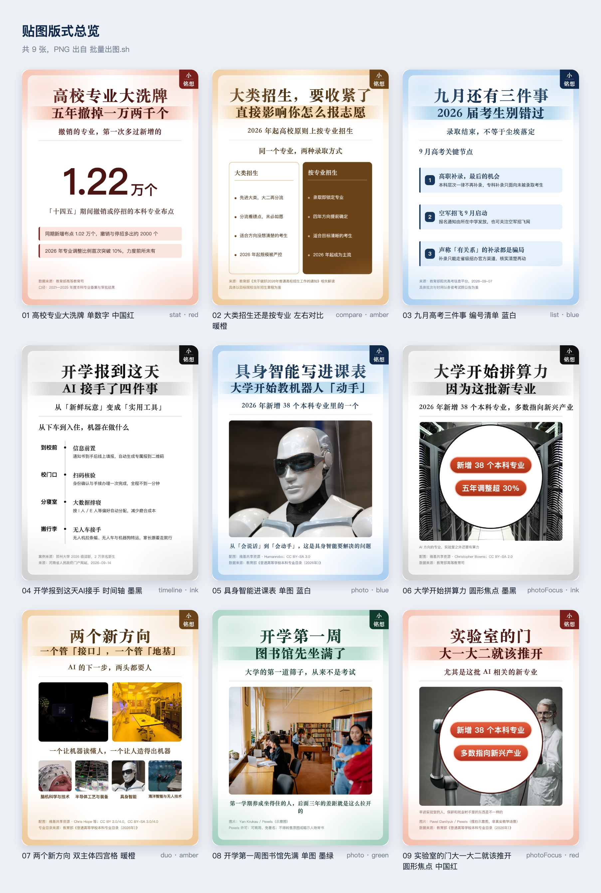

# 公众号贴图工坊 · gzh-tietu-studio

一份 JSON 数据，批量产出 **810×1080（精确 3:4）** 的公众号贴图 / 信息图。

同一套骨架（水彩底 + 白色圆角卡片 + 双行主标题 + 账号角标 + 来源注释），**只换内容区**——
所以做 9 种版式不需要写 9 个模板，改一个字段就切换。

- **9 种版式**：单数字冲击 / 编号清单 / 左右对比 / 时间轴 / 双轴柱线图 / 横向条形 / 单图 / 圆形焦点 / 双主体+四宫格
- **5 套配色**：蓝白 / 中国红 / 墨绿 / 暖橙 / 墨黑
- **三路输出**：PNG（发布用，2 倍图）/ SVG（拖进 Figma 二次设计）/ 九宫格总览（批量自查）
- **自动配图**：维基共享资源 + NASA + Pexels，下载时自动打印作者与许可
- **零 npm 依赖**：只用 Node 内置模块 + 系统自带 `sips` + 本机 Chrome

---

## 📖 说明书 · 先看这个

# → [打开完整中文说明书](说明书.md)

> **说明书里有什么**：环境准备 · 9 种版式逐个讲 · 三个图源怎么找图 · 全字段速查表 · 导出可编辑 SVG · 九宫格总览 · 常见问题 · 踩坑清单
>
> - 想改模板、改配色、调间距、了解排版原理 → [`docs/贴图排版手册.md`](docs/贴图排版手册.md)
> - 示例图片的作者与许可 → [`examples/CREDITS.md`](examples/CREDITS.md)

---

## 效果预览

九种版式（同一套骨架，只换内容区）——见 [`examples/预览/九种版式总览.jpg`](examples/预览/九种版式总览.jpg)



一批真实热点（含配图、四宫格图片版）——见 [`examples/预览/热点贴图总览.jpg`](examples/预览/热点贴图总览.jpg)



## 30 秒上手

```bash
git clone <本仓库>
cd gzh-tietu-studio

# 用示例数据跑一遍，输出到 out/
./批量出图.sh examples/数据-九种版式示例.json out

# 回读校验：逐张量内容区放不放得下
./检查溢出.sh out

# 生成总览，并截成一张图，一眼看完 9 张
node 生成总览.js examples/数据-九种版式示例.json out "九种版式示例"
./总览截图.sh out
```

做自己的图：复制 `examples/数据-九种版式示例.json`，改成你的内容。

```bash
./批量出图.sh 我的数据.json 输出目录        # 批量出 PNG（2 倍图 1620×2160）
./检查溢出.sh 输出目录                      # 回读校验：内容有没有顶到页脚上
node 导出SVG.js 我的数据.json svg输出       # 导出可编辑 SVG，拖进 Figma
node 生成总览.js 我的数据.json 输出目录 "标题"  # 九宫格总览
./总览截图.sh 输出目录                      # 总览存成 _总览.png
```

最小可用数据（一张图 = 一个对象）：

```json
[
  {
    "name": "01_高校专业大洗牌_单数字_中国红",
    "layout": "stat",
    "theme": "red",
    "badge": "小铭想",
    "title1": "高校专业大洗牌",
    "title2": "五年撤掉一万两千个",
    "deck": "撤销的专业，第一次多过新增的",
    "statValue": "1.22",
    "statUnit": "万个",
    "statLabel": "「十四五」期间撤销或停招的本科专业布点",
    "statSubs": ["同期新增布点 1.02 万个", "2026 年调整比例首次突破 10%"],
    "foot": ["数据来源：教育部高等教育司"]
  }
]
```

## 配图

`photo` / `photoFocus` / `duo` 三个版式要图，`duo` 的四宫格图可选。图源全部免费可商用：

```bash
node 找图.js search "humanoid robot" 8      # 维基共享资源 · 全文搜
node 找图.js cat "Humanoid robots" 8        # 维基共享资源 · 按分类，更准
node 找图.js get "File:xxx.jpg" img 1600    # 下载到 img/，打印作者/许可/原页
node 找图.js nasa "mars rover" 8            # NASA 图库（公有领域）
node 找图.js nasa-get "PIA07081" img 1600
node 找图.js pexels "campus library" 8      # Pexels（需 key，现代实拍感最好）
node 找图.js pexels-get "8199659" img 1600
```

Pexels 的 key 不写进脚本，按顺序找：环境变量 `PEXELS_API_KEY` → `~/.workbuddy/pexels.key` → 项目内 `.pexels-key`。

**署名是使用条件，不是礼貌**：CC BY / CC BY-SA 必须署名作者，CC0 / 公有领域不强制。
脚注只写三样 —— 来源、作者、许可名（`配图：维基共享资源 · N509FZ；CC BY-SA 4.0`），
许可条款原文（「经裁剪，按相同许可发布」之类）不进脚注，留在 `配图署名.md` 台账里。
`node 署名行.js 数据源.json` 能自动拼出这行并报出字宽。具体规则和各图源的取舍见 [`说明书.md`](说明书.md) 第四节。

## 目录结构

```
gzh-tietu-studio/
├── 说明书.md                  # ★ 完整中文说明书（主入口，先读这份）
├── README.md                 # 本文件：简介 + 预览 + 上手
├── SKILL.md                  # 作为 WorkBuddy 技能使用时的入口说明
├── 贴图模板.html              # 模板本体（浏览器打开就是设计台，可切版式/配色）
├── 主题.js                    # 5 套配色（HTML 与 SVG 共用）
├── 批量出图.js / 批量出图.sh   # 批量出 PNG
├── 导出SVG.js                 # 导出可编辑 SVG（图片 base64 内嵌）
├── 找图.js                    # 维基共享 / NASA / Pexels 取图；page/url 抓官方媒体图
├── 查署名.js                  # 按 Commons 标题补查作者与许可（只读元数据，不下载图）
├── 署名行.js                   # 生成脚注署名行（扫图 → 查台账 → 拼好），并报出字宽
├── 探测分类.js / 列分类.js      # 挖中国题材：批量试哪些分类有图 / 列出某分类全部文件名
├── 生成总览.js                # 九宫格总览页（只出 HTML）
├── 总览截图.js / 总览截图.sh   # 总览页存成 PNG（先量页高再截，不留白不截断）
├── 检查溢出.js / 检查溢出.sh   # 出图后回读校验：内容有没有顶到页脚上
├── vendor/echarts.min.js      # 图表版式依赖，别删
├── docs/
│   └── 贴图排版手册.md         # 进阶：排版原理、骨架常量、14 个坑
└── examples/
    ├── 数据-九种版式示例.json
    ├── 数据-热点示例.json
    ├── CREDITS.md             # 示例图片的作者 / 许可 / 原页
    ├── img/                   # 示例配图
    └── 预览/                  # 输出预览图
```

## 环境要求

| 依赖 | 说明 |
|---|---|
| Node.js | ≥ 16 即可，无 npm 依赖 |
| Chrome / Edge / Chromium | 无头截图（脚本自动探测常见路径） |
| macOS `sips` | 图片压缩；非 macOS 自动跳过，功能不受影响 |

## 更新记录

- **2026-09-16** 改署名口径：**脚注只写来源、作者、许可名**，不再抄许可条款原文。
  「经裁剪，按相同许可发布」这类黑话读者看不懂——它是要留档的事实，留在 `配图署名.md` /
  `examples/CREDITS.md` 台账里即可（2026-09-14 那条「在脚注补一行说明」的做法作废）。
  新增 `署名行.js`：从数据源扫出真正用到的图（含 `quadImgs` 数组）、查台账、拼好这行，
  并报出占多少字宽（超 41 会自动收窄作者、给出放得下的版本）。示例数据与两份预览图同步重出。
- **2026-09-16 · 补** `署名行.js` 认 Pexels 许可（放在 CC 匹配之前，否则会掉进「许可待核」）；
  台账里的 Pexels 表必须是 5 列，少一列会让整表列序错位。
- **2026-09-15 · 三** 定两条口径、加三个选图小工具：
  ① **`duo` 的四宫格默认给满 `quadImgs`**——不给会退回「首字大卡」（四个色块各压一个大号汉字），
  那是兜底样式；配套提醒：`duo` 共 6 张图会挤爆 3 行脚注。
- **2026-09-16 · 纠错** 作废「竖构图照片别放宫格，会被裁成中间一条」。实测（`duo` 页逐张量渲染框）：
  宫格 152×142 近方形，4:3 横图留 81%、3:2 留 72%、2:3 竖图留 70%——竖图能放。
  真正吃画幅的是 `duo` 主体（320×272 + `object-position: top center`），16:9 宽幅图只留 66%。
  ② **找中国题材要用带 `in China` 的分类，别用中文全文搜**——搜「小学」会跨语言匹配到波兰、
  赞比亚的小学。新增 `探测分类.js`（批量试哪些分类有图）和 `列分类.js`（列某分类全部文件名），
  以及 `查署名.js`（漏抄署名时按标题补查，只读元数据）。
  ③ 明确「验图」的判据：中心切片只能当提示（`photoFocus` 的正中被白圆盖住、白色实验室场景
  本身就压得小，都会误报），**决定性做法是 A/B**——把 `img` 换成不存在的路径再出一张比总字节数。
- **2026-09-15 · 二** 加两件工具、补一类图源：
  ① 新增 `./总览截图.sh`——先让页面报出真实页高再截图，不再写死 `--window-size`
  （总览页高随张数变化，写死不是底部留白就是截掉最后一行）。
  ② `找图.js` 新增 `page` / `url` 两条命令，抓官方媒体图的主图与标题、媒体名、记者，
  并在说明书写清《著作权法》二十四条的四要件（说明书 4.5）。
  ③ 补一节「怎么找中国题材的图」（说明书 4.1.1）。
- **2026-09-15** 修三个缺陷：① `duo` 的固定高度加起来比内容区多 17px，内容会盖到页脚上——
  肉眼看图几乎发现不了，为此新增 `./检查溢出.sh` 逐张量 `scrollHeight - clientHeight` 做回读校验。
  ② `chart` 右轴原本写死成金额（`$…tn`），改成 `wealthAxisFormat` / `wealthLabelFormat` /
  `wealthDecimals` 可覆盖——画人数、台数、亿元不用再改代码；同时给折线数字垫了一层白底，压在柱子上也读得清。
  ③ `timeline` 日期列宽卡在临界点上，`9月10日` 会折行而 `9月11日` 不会，现在统一 `white-space: nowrap`，
  并让 HTML 与 SVG 两条路表现一致。另外 `批量出图.sh` 在 Chrome 自身沙箱初始化失败时自动回退 `--no-sandbox`，
  顺带补回 `找图.js` 里漏同步的 0 字节残留清理。
- **2026-09-14** 首次发布：9 种版式 / 5 套配色 / 三路输出（PNG、SVG、九宫格总览）/ 三个图源（维基共享、NASA、Pexels）。
- **2026-09-14 · 修订**（署名写法**已由 2026-09-16 那条取代**）曾约定 BY-SA 图被裁剪后在 `foot` 里补一行
  「经裁剪改编，本图按相同许可 CC BY-SA x.0 发布」。同时明确脚注**最多 3 行**（一行约 41 个汉字 / 76 个西文字符）。

## 许可

代码：MIT（见 `LICENSE`）。
`examples/img/` 与 `examples/预览/` 里的图片来自维基共享资源、NASA、Pexels，
版权归原摄影者所有，各自许可见 [`examples/CREDITS.md`](examples/CREDITS.md)——**转载示例图请自行遵守原许可**。
