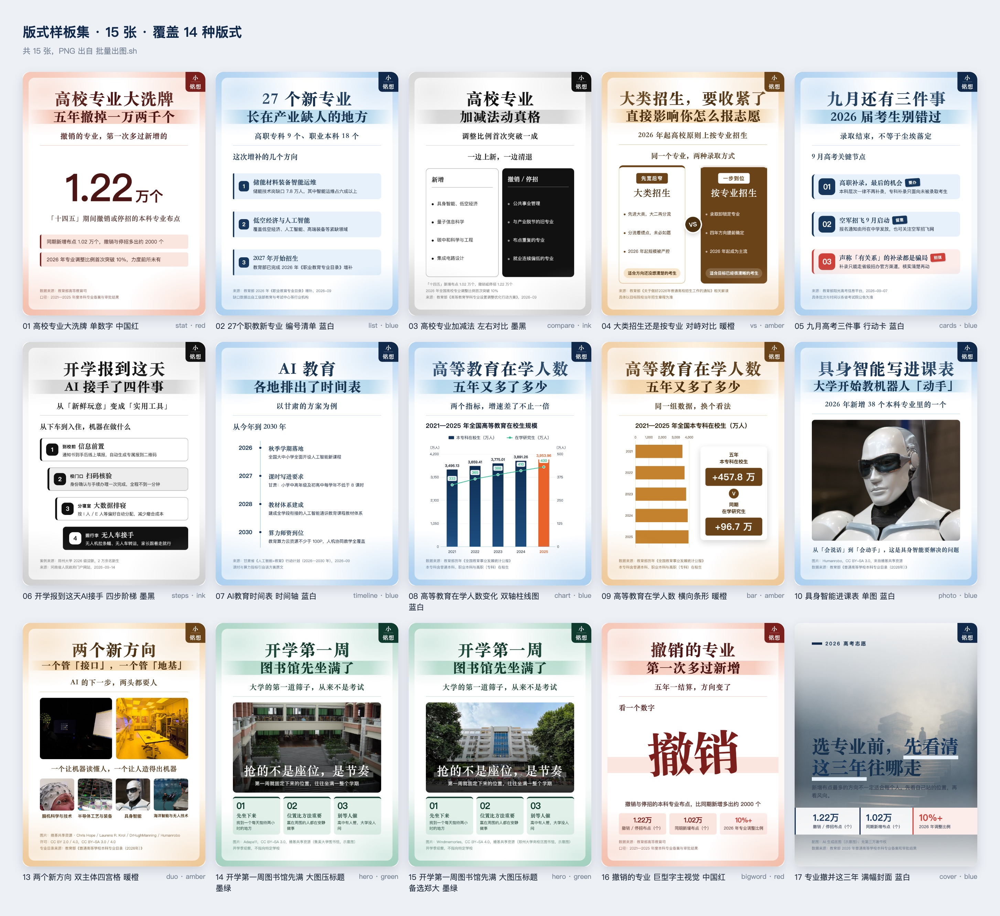

# 公众号贴图工坊 · gzh-tietu-studio

一份 JSON 数据，批量产出 **810×1080（精确 3:4）** 的公众号贴图 / 信息图。

同一套骨架（水彩底 + 白色圆角卡片 + 双行主标题 + 账号角标 + 来源注释），**只换内容区**——
所以做 16 种版式不需要写 16 个模板，改一个字段就切换。

**另外还有一层开关**：`"shell": "full"` 会拆掉白卡、让底图铺满整张画布 —— **16 个版式都能加**。
这是"信息图"和"海报"之间的那道门。

- **16 种版式**：单数字冲击 / 编号清单 / 左右对比 / 对峙对比 / 编号行动卡 / 四步阶梯 /
  时间轴 / 双轴柱线图 / 横向条形 / 单图 / 圆形焦点 / 双主体+四宫格 / 大图压标题 /
  巨型字主视觉 / 横向色带分割 / **满幅封面**
- **满幅外壳**：`"shell": "full"` 拆掉白卡 + `bg` 底图铺满画布，文字直接压在图上；
  出血元素会自动从"卡内出血 50px"变成"画布出血 76px"
- **5 套配色**：蓝白 / 中国红 / 墨绿 / 暖橙 / 墨黑
- **三路输出**：PNG（发布用，2 倍图）/ SVG（拖进 Figma 二次设计）/ 总览图（批量自查）
- **自动配图**：维基共享资源 + NASA + Pexels；没有合适实拍时可用 **AI 生成底图**，
  脚注自动拼成 `配图：AI 生成底图（示意图）；无第三方著作权`
- **四道自检**：出图自带体检 + 越界探针 + 海报探针 + SVG 几何校验，不靠"应该没问题"
- **零 npm 依赖**：只用 Node 内置模块 + 系统自带 `sips` + 本机 Chrome

---

## 📖 说明书 · 先看这个

# → [打开完整中文说明书](说明书.md)

> **说明书里有什么**：环境准备 · 16 种版式逐个讲 · 满幅外壳怎么开 · 三个图源怎么找图 · 全字段速查表 · 导出可编辑 SVG · 总览图 · 常见问题 · 踩坑清单
>
> - 想改模板、改配色、调间距、了解排版原理 → [`docs/贴图排版手册.md`](docs/贴图排版手册.md)
> - 想知道"海报感"是怎么来的、还有哪些手法没做 → [`docs/视觉海报案例学习笔记.md`](docs/视觉海报案例学习笔记.md)
> - 示例图片的作者与许可 → [`examples/CREDITS.md`](examples/CREDITS.md)

---

## 效果预览

**16 种版式样板集**（同一套骨架，只换内容区，含配图、四宫格图片版与满幅封面）——
见 [`examples/预览/版式样板集总览.jpg`](examples/预览/版式样板集总览.jpg)



九种版式示例——见 [`examples/预览/九种版式总览.jpg`](examples/预览/九种版式总览.jpg)


一批真实热点（含配图、四宫格图片版）——见 [`examples/预览/热点贴图总览.jpg`](examples/预览/热点贴图总览.jpg)


## 30 秒上手

```bash
git clone <本仓库>
cd gzh-tietu-studio

# 用示例数据跑一遍，输出到 out/
# 出图 + 体检是同一趟：跑完直接印「✅ 放得下 … 图 6/6 张」
./批量出图.sh examples/数据-样板集.json out

# 想回头重看上次的体检结论（读缓存，不启浏览器）
./检查溢出.sh out

# 生成总览并截图（可选，默认不用出）
node 生成总览.js examples/数据-样板集.json out "版式样板集" --cols=5
./总览截图.sh out 1938 1.5
```

做自己的图：复制 [`examples/数据-样板集.json`](examples/数据-样板集.json)（18 张，覆盖全部 16 种版式）
或 [`examples/数据-九种版式示例.json`](examples/数据-九种版式示例.json)，改成你的内容。

```bash
./批量出图.sh 我的数据.json 输出目录        # 批量出 PNG（2 倍图 1620×2160）
./检查溢出.sh 输出目录                      # 回读校验：内容有没有顶到页脚上
node 导出SVG.js 我的数据.json svg输出       # 导出可编辑 SVG，拖进 Figma
node 生成总览.js 我的数据.json 输出目录 "标题"  # 九宫格总览
./总览截图.sh 输出目录                      # 总览存成 _总览.png
```

最小可用数据（一张图 = 一个对象）：

```json
[
  {
    "name": "01_高校专业大洗牌_单数字_中国红",
    "layout": "stat",
    "theme": "red",
    "badge": "小铭想",
    "title1": "高校专业大洗牌",
    "title2": "五年撤掉一万两千个",
    "deck": "撤销的专业，第一次多过新增的",
    "statValue": "1.22",
    "statUnit": "万个",
    "statLabel": "「十四五」期间撤销或停招的本科专业布点",
    "statSubs": ["同期新增布点 1.02 万个", "2026 年调整比例首次突破 10%"],
    "foot": ["数据来源：教育部高等教育司"]
  }
]
```

## 配图

`photo` / `photoFocus` / `duo` / `hero` 四个版式要图，`duo` 的四宫格图可选。图源全部免费可商用：

```bash
node 找图.js search "humanoid robot" 8      # 维基共享资源 · 全文搜
node 找图.js cat "Humanoid robots" 8        # 维基共享资源 · 按分类，更准
node 找图.js get "File:xxx.jpg" img 1600    # 下载到 img/，打印作者/许可/原页
node 找图.js nasa "mars rover" 8            # NASA 图库（公有领域）
node 找图.js nasa-get "PIA07081" img 1600
node 找图.js pexels "campus library" 8      # Pexels（需 key，现代实拍感最好）
node 找图.js pexels-get "8199659" img 1600
```

Pexels 的 key 不写进脚本，按顺序找：环境变量 `PEXELS_API_KEY` → `~/.workbuddy/pexels.key` → 项目内 `.pexels-key`。

**署名是使用条件，不是礼貌**：CC BY / CC BY-SA 必须署名作者，CC0 / 公有领域不强制。
脚注只写三样 —— 来源、作者、许可名（`配图：维基共享资源 · N509FZ；CC BY-SA 4.0`），
许可条款原文（「经裁剪，按相同许可发布」之类）不进脚注，留在 `配图署名.md` 台账里。
`node 署名行.js 数据源.json` 能自动拼出这行并报出字宽。具体规则和各图源的取舍见 [`说明书.md`](说明书.md) 第四节。

## 目录结构

```
gzh-tietu-studio/
├── 说明书.md                  # ★ 完整中文说明书（主入口，先读这份）
├── README.md                 # 本文件：简介 + 预览 + 上手
├── SKILL.md                  # 作为 WorkBuddy 技能使用时的入口说明
├── 贴图模板.html              # 模板本体（浏览器打开就是设计台，可切版式/配色）
├── 主题.js                    # 5 套配色（HTML 与 SVG 共用）
├── 批量出图.js / 批量出图.sh   # 批量出 PNG（多张并发，出图顺带体检）
├── 导出SVG.js                 # 导出可编辑 SVG（图片 base64 内嵌）
├── 找图.js                    # 维基共享 / NASA / Pexels 取图；page/url 抓官方媒体图
├── 查署名.js                  # 按 Commons 标题补查作者与许可（只读元数据，不下载图）
├── 署名行.js                   # 生成脚注署名行（扫图 → 查台账 → 拼好），并报出字宽
├── 探测分类.js / 列分类.js      # 挖中国题材：批量试哪些分类有图 / 列出某分类全部文件名
├── 生成总览.js                # 总览页（只出 HTML），--cols=N 调列数
├── 总览截图.js / 总览截图.sh   # 总览页存成 PNG（先量页高再截，不留白不截断）
├── 预览截图.sh                 # SVG 预览页存成 PNG（封装"后台起进程+轮询文件大小"）
├── 度量.js                    # 出图时注入页面的体检探针：溢出量 / 真图数 / 缺图数
├── 检查溢出.js / 检查溢出.sh   # 重看体检结论（读缓存，不启浏览器；没缓存才回退探针）
├── svg校验.js                  # 量导出 SVG 的真实边界（getBBox），查文字顶出画布/盖脚注
├── 越界探针.js                 # 量页面里每个元素的 rect，抓「看得见地顶出卡片」；.bleed 是白名单
├── 海报探针.js                 # 读 computedStyle/naturalWidth，确认字号/色块/倾斜/满幅底图真的生效
├── vendor/echarts.min.js      # 图表版式依赖，别删
├── docs/
│   ├── 贴图排版手册.md         # 进阶：排版原理、骨架常量、满幅外壳、海报化视觉手段、23 个坑
│   └── 视觉海报案例学习笔记.md  # 案例拆解 → 手法 → 落到哪个版式 → 怎么验
└── examples/
    ├── 数据-样板集.json         # ★ 18 张、覆盖全部 16 种版式（含两个 hero 选图版本）
    ├── 数据-九种版式示例.json
    ├── 数据-热点示例.json
    ├── CREDITS.md             # 示例图片的作者 / 许可 / 原页（含 AI 生成底图）
    ├── img/                   # 示例配图
    │   └── ai/                # 两张 AI 生成底图（1024×1536，用于满幅封面）
    └── 预览/                  # 输出预览图
```

## 环境要求

| 依赖 | 说明 |
|---|---|
| Node.js | ≥ 16 即可，无 npm 依赖 |
| Chrome / Edge / Chromium | 无头截图（脚本自动探测常见路径） |
| macOS `sips` | 图片压缩；非 macOS 自动跳过，功能不受影响 |

## 更新记录

- **2026-09-16 · 四 · 拆掉白卡：满幅外壳 + `cover`，版式 15 → 16** 用户给了两个 WorkBuddy
  内置海报场景的分享口令（`$26708352$` / `$52609598$`，AI 教育课海报 / 战略分享会海报），
  并说「其实可以突破限制」。那两个口令读不到源文件（场景画廊是内置的），所以是按**那一类海报的骨架**
  对标 —— 一张底图铺满、大字压上去、没有白卡。落成两件事：
  - **满幅外壳 `"shell": "full"`** —— 不是新版式，而是**和版式正交的维度：16 个版式都能加**。
    关键做法是**只换背景层、不动布局**：卡面透明、去圆角，但 `inset:26px` / `padding:50px` 全留着，
    所以内容边界没变、**溢出检查和越界探针原封不动继续有效**。三个类分层：`.full` 拆卡 /
    `.hasbg` 有底图才挂淡纱 / `.own-title` 藏掉共用标题。只写 `shell` 不写 `bg` 时得到
    "无卡的纯色满幅"（`band` 配这一档最好看）。满幅下出血元素自动从"卡内 50px"变成"画布 76px"。
  - **`cover` 满幅封面** —— 底图铺满 + 顶部小标签 + **82px 左对齐大字**（支持 `<em>` 行内高亮）
    + 底部一条**画布出血**的数字带（x=0 → 810，色块出血但文字仍对齐 76px）。
    它自带满幅、并藏掉共用双行标题；大字**故意不接 `fitText`**（否则会被压到下限），
    超字数由 `越界探针.js` 报出来 —— 宁可报错，不要静默把封面大字缩小。
  - 新增 **AI 生成底图**这一路素材：2 张 1024×1536 竖图（阶梯上升意象 / 宣纸水墨）。`署名行.js`
    新增「AI 生成」许可族，自动拼成 `配图：AI 生成底图（示意图）；无第三方著作权`。
  - 顺手修掉一个**遗留缺陷**：第 13 张（`duo`）有 3 张图从未登记台账（脑机接口实验 / EEG 电极帽 /
    RoboSub 水下机器人），CC 图不登记就是漏署名，已补全；`RoboSub_diver.jpg` 的标题按尺寸反推、
    台账里注明了依据。另清理了 `.pages/` 里删卡前的旧页面与探针残留。
  - 三个新坑（手册第 19–22 条）：**`bg` 字段名不含 `img`**，不在白名单里就会静静 404、
    体检打「图 0/0 张」（看着像探针不认字段，其实是图没加载）；**满幅改出血位置，两条渲染路要
    一起改**（SVG 里 `rect(PAD,…)` 是写死常量，得走同一个 `bleedBox()`）；**`.bleed` 白名单要用
    `closest`**（出血容器里的子元素同样在卡外）。
  - 又一批**纯增量**：老 14 张 PNG 的 md5 **逐字节未变**。样板集 14 → **17 张**。
- **2026-09-16 · 五 · 补齐 `photoFocus` + 修两个台账缺陷** 样板集 17 → **18 张**，
  **首次覆盖全部 16 种版式**（`photoFocus` 此前一直没有样张，而"白圆盖住中间"这件事
  光看 `photo` 是讲不清的）。素材与数据取自早先 `热点0914.json` 的「大学开始拼算力」，
  脚注换成新口径（不再写"经裁剪改编，按相同许可发布"）。其余 17 张 PNG 字节数不变。
  - 修掉 **`署名行.js` 与 `examples/CREDITS.md` 的列序不兼容**：`parseLedger` 取的是
    第 1 列文件名 / 第 3 列作者 / 第 4 列许可，而 CREDITS.md 原表是 `本地文件 | 作者 | 许可 | 原页`
    —— 于是**把许可名当成作者、把原页链接当成许可**，输出 `配图：维基共享资源 · [CC BY-SA 3.0](…)；许可待核`。
    已把三个表统一成 `本地文件 | 原页 | 作者 | 许可`（Pexels 表 5 列），并在文件顶部写明
    **列序不能改**（改了脚本不报错，只在输出里悄悄出一句「许可待核」）。
  - `署名行.js` 的台账候选名补上 `CREDITS.md`：此前只找 `配图署名.md`，
    在包内 `examples/` 下跑会**全部标成「未登记」**（README 却一直把 CREDITS.md 称作台账）。
- **2026-09-16 · 三 · 学视觉海报案例，版式 13 → 15** 把「视觉海报精选案例」（站酷《9 组版式实验》
  《字里藏境》《七个案例教你设计春节海报》、搜狐《排版中的图形构成》、Brutalist Graphics、
  Rishfield 视觉层级 9 法）逐条拆成可复用手法，落地成两个新海报版式：
  - **`bigword` 巨型字主视觉** —— 文字图形化。210px 巨型字吃掉整行、下半段压一条**满幅出血**
    的主题色块垫（左右各出 50px，正好顶到卡片内边距外）、整块转 -3° 破网格。宽度自适应：
    2 字原尺寸、4 字缩到约 165px。底部最多 3 个数字块。
  - **`band` 横向色带分割** —— 水平分割 + 大面积色块。画面切成 2–4 条**满幅出血、零间距、等高**
    的横向色带，色带本身就是装饰。三档色（深反白 / 浅色 / 纯白 + 上下细线），不写就深浅交替。
  - 手法与取舍写在 [`docs/视觉海报案例学习笔记.md`](docs/视觉海报案例学习笔记.md)：**哪些做了、
    哪些故意没做**（负形藏画、Xerox 颗粒、文字绕排…）、以及还没落地的 4 条候选。
  - 又两个**纯增量**版式：老 15 张 PNG 的 md5 **逐字节未变**。样板集 15 → **17 张**。
  - 踩到并修掉两个新坑：**`border` 会破坏 flex 等分高度**（色带 173/177/173 → 改用 `box-shadow`
    后 175/175/175）、**`fitText` 在 shrink-to-fit 容器里会失效**（巨型字容器必须显式 `width:100%`）。
    另给 `越界探针.js` 加了 `.bleed` 白名单（满幅出血是设计内的）。
- **2026-09-16 · 版式扩容 + 海报化** 版式 **9 → 13**，新增 `vs` 对峙对比 / `cards` 编号行动卡 /
  `steps` 四步阶梯 / `hero` 大图压标题，四个都是**纯增量**（老版式渲染结果逐字节未变）。
  随后按「视觉海报 / 运营海报」的手法把这四个重做了一遍视觉语言：实心色块编号、左侧 8px 色条、
  倾斜贴纸标签、68px 倾斜 VS 徽章、54px 大字结论 + 半透明高亮垫。同步：`导出SVG.js` 补齐这 4 个版式
  （以前会**静默回退成 `photo`**，现在会告警）、新增 `svg校验.js` / `越界探针.js` / `海报探针.js`
  三个校验工具、`生成总览.js` 支持 `--cols`、`examples/数据-样板集.json`（15 张覆盖 13 版式）。
- **2026-09-16 · 提速** 出图流程 **49s → 5s**（一批 6 张图）：
  ① **校验并进出图那一趟**——只读探针（新增 `度量.js`）注入页面，截图时多要一份 `--dump-dom`，
  「放不放得下 / 真图几张 / 有没有缺图」跟着截图一起回来（以前这三项要各起一趟 Chrome，21s）；
  ② **多张并发**（按核数，上限 6），不再一张一张等；
  ③ **要不要 `--no-sandbox` 只探一次**，结论缓存在 `.pages/.chrome-extra`；
  ④ 总览改为**可选**，默认不出。
  验收：新旧流程的 PNG **6/6 逐字节相同**（md5 一致），说明探针不影响渲染。
- **2026-09-16** 改署名口径：**脚注只写来源、作者、许可名**，不再抄许可条款原文。
  「经裁剪，按相同许可发布」这类黑话读者看不懂——它是要留档的事实，留在 `配图署名.md` /
  `examples/CREDITS.md` 台账里即可（2026-09-14 那条「在脚注补一行说明」的做法作废）。
  新增 `署名行.js`：从数据源扫出真正用到的图（含 `quadImgs` 数组）、查台账、拼好这行，
  并报出占多少字宽（超 41 会自动收窄作者、给出放得下的版本）。示例数据与两份预览图同步重出。
- **2026-09-16 · 补** `署名行.js` 认 Pexels 许可（放在 CC 匹配之前，否则会掉进「许可待核」）；
  台账里的 Pexels 表必须是 5 列，少一列会让整表列序错位。
- **2026-09-15 · 三** 定两条口径、加三个选图小工具：
  ① **`duo` 的四宫格默认给满 `quadImgs`**——不给会退回「首字大卡」（四个色块各压一个大号汉字），
  那是兜底样式；配套提醒：`duo` 共 6 张图会挤爆 3 行脚注。
- **2026-09-16 · 纠错** 作废「竖构图照片别放宫格，会被裁成中间一条」。实测（`duo` 页逐张量渲染框）：
  宫格 152×142 近方形，4:3 横图留 81%、3:2 留 72%、2:3 竖图留 70%——竖图能放。
  真正吃画幅的是 `duo` 主体（320×272 + `object-position: top center`），16:9 宽幅图只留 66%。
  ② **找中国题材要用带 `in China` 的分类，别用中文全文搜**——搜「小学」会跨语言匹配到波兰、
  赞比亚的小学。新增 `探测分类.js`（批量试哪些分类有图）和 `列分类.js`（列某分类全部文件名），
  以及 `查署名.js`（漏抄署名时按标题补查，只读元数据）。
  ③ 明确「验图」的判据：中心切片只能当提示（`photoFocus` 的正中被白圆盖住、白色实验室场景
  本身就压得小，都会误报），**决定性做法是 A/B**——把 `img` 换成不存在的路径再出一张比总字节数。
- **2026-09-15 · 二** 加两件工具、补一类图源：
  ① 新增 `./总览截图.sh`——先让页面报出真实页高再截图，不再写死 `--window-size`
  （总览页高随张数变化，写死不是底部留白就是截掉最后一行）。
  ② `找图.js` 新增 `page` / `url` 两条命令，抓官方媒体图的主图与标题、媒体名、记者，
  并在说明书写清《著作权法》二十四条的四要件（说明书 4.5）。
  ③ 补一节「怎么找中国题材的图」（说明书 4.1.1）。
- **2026-09-15** 修三个缺陷：① `duo` 的固定高度加起来比内容区多 17px，内容会盖到页脚上——
  肉眼看图几乎发现不了，为此新增 `./检查溢出.sh` 逐张量 `scrollHeight - clientHeight` 做回读校验。
  ② `chart` 右轴原本写死成金额（`$…tn`），改成 `wealthAxisFormat` / `wealthLabelFormat` /
  `wealthDecimals` 可覆盖——画人数、台数、亿元不用再改代码；同时给折线数字垫了一层白底，压在柱子上也读得清。
  ③ `timeline` 日期列宽卡在临界点上，`9月10日` 会折行而 `9月11日` 不会，现在统一 `white-space: nowrap`，
  并让 HTML 与 SVG 两条路表现一致。另外 `批量出图.sh` 在 Chrome 自身沙箱初始化失败时自动回退 `--no-sandbox`，
  顺带补回 `找图.js` 里漏同步的 0 字节残留清理。
- **2026-09-14** 首次发布：9 种版式 / 5 套配色 / 三路输出（PNG、SVG、九宫格总览）/ 三个图源（维基共享、NASA、Pexels）。
- **2026-09-14 · 修订**（署名写法**已由 2026-09-16 那条取代**）曾约定 BY-SA 图被裁剪后在 `foot` 里补一行
  「经裁剪改编，本图按相同许可 CC BY-SA x.0 发布」。同时明确脚注**最多 3 行**（一行约 41 个汉字 / 76 个西文字符）。

## 许可

代码：MIT（见 `LICENSE`）。
`examples/img/` 与 `examples/预览/` 里的图片来自维基共享资源、NASA、Pexels，
版权归原摄影者所有，各自许可见 [`examples/CREDITS.md`](examples/CREDITS.md)——**转载示例图请自行遵守原许可**。
